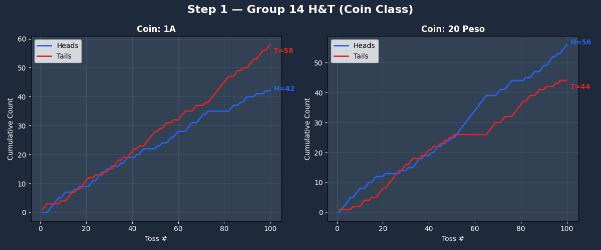
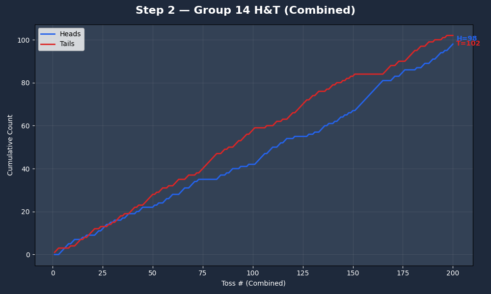
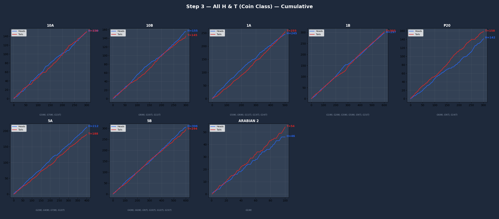
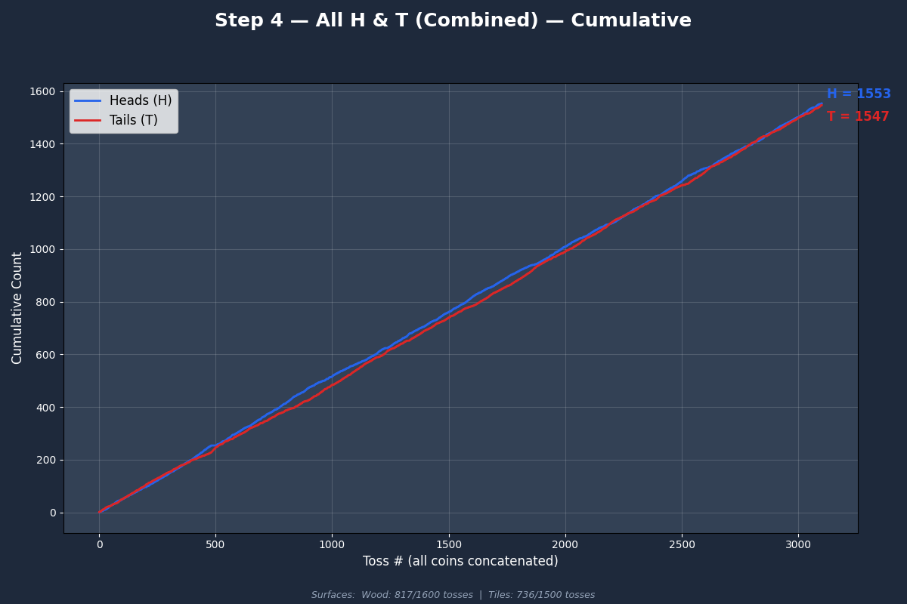
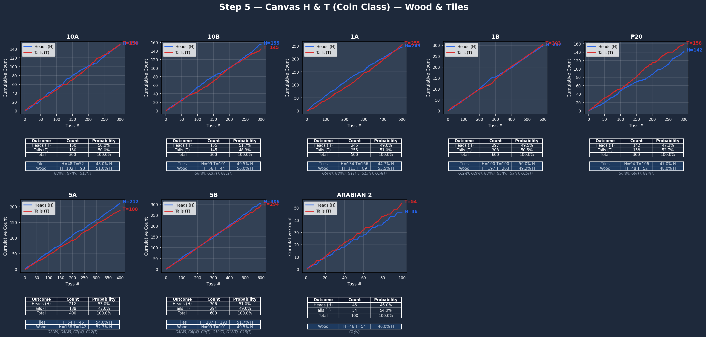
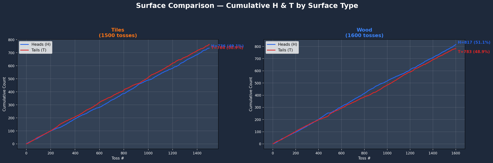
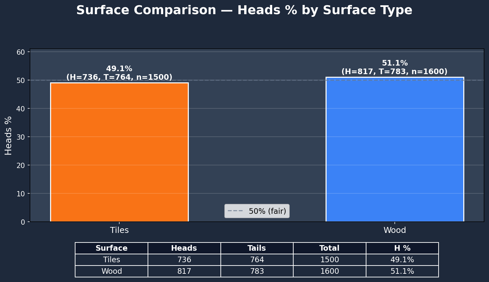
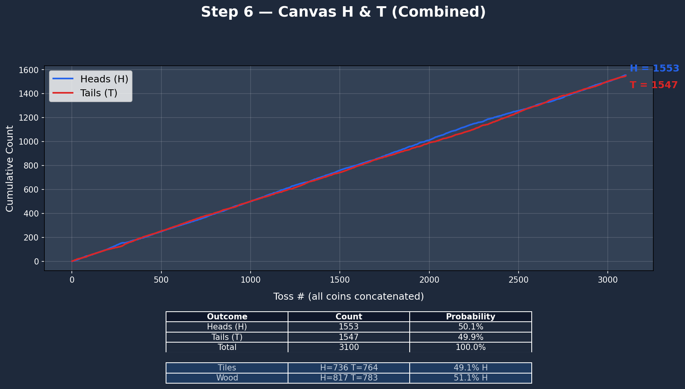

# 🪙 Coin Toss Experiment Analysis — Group 14

This repository contains the analysis and visualization of coin toss experimental data, focusing on **Group 14's results** as well as a **comparative analysis across all groups (1–15)**.

The experiment involved tossing different denominations of coins on varying surfaces (**Wood** and **Tiles**) to observe the probability distribution of Heads and Tails.

## 📂 Project Structure

The analysis is divided into 6 sequential steps, each represented by a Python script and a corresponding output chart.

### 🛠 Dependencies
*   Python 3.x
*   `matplotlib`
*   `openpyxl`
*   `numpy`

To run the analysis:
```bash
python group14_step1.py
# ... and so on for each step
# Or run them all together:
# python group14_step1.py; python group14_step2.py; ...
```

---

## 📊 Analysis Steps & Results

### Step 1: Group 14 — Coin Class Analysis
**Script:** `group14_step1.py`

Analysis of **Group 14's specific coins** ("1A" and "20 Peso") tossed on **Tiles**. This chart tracks the cumulative frequency of Heads vs. Tails for each coin individually.



---

### Step 2: Group 14 — Combined Analysis
**Script:** `group14_step2.py`

A combined cumulative chart aggregating outcomes from **both coins** used by Group 14. This provides a total view of the group's experiment outcomes on the Tile surface.



---

### Step 3: All Groups — Global Coin Class Analysis
**Script:** `group14_step3.py`

A comparative view of **all coin classes** across all 15 groups. This visualization distinguishes between surface types (**Wood** for Groups 1–8, **Tiles** for Groups 9–15) and tracks the cumulative trends for every coin type used in the class (e.g., 1A, 1B, 5A, 5B, Arabian 2, etc.).



---

### Step 4: All Groups — Global Combined Analysis
**Script:** `group14_step4.py`

Accepting the Law of Large Numbers, this step aggregates **every single coin toss** from the entire class dataset (Groups 1–15). It compares the overall Heads vs. Tails outcome against the theoretical 50% probability.



---

### Step 5: Canvas — Detailed Coin Class Breakdown
**Script:** `group14_step5.py`

A comprehensive "Canvas" layout providing detailed statistics for each coin class across the entire class.
*   **Visuals:** Cumulative Line Charts for each coin.
*   **Data:** Probability summary tables.
*   **Surface Breakdown:** Analysis distinguishing between **Wood** and **Tiles** performance.



#### Surface Comparison Analysis
These charts compare the overall probability of Heads vs. Tails across the two surface types: **Wood** (Groups 1–8) and **Tiles** (Groups 9–15).

*   **Cumulative Comparison**: Tracks the cumulative count of Heads for Wood vs. Tiles.
    
*   **Bar Chart Comparison**: A direct comparison of the final Head probability percentages.
    

---

### Step 6: Canvas — Global Combined Summary
**Script:** `group14_step6.py`

The final summary dashboard combining all data points. It features a cumulative trend line for the entire dataset and a precise summary table breaking down the probabilities by surface type.




---

## 📝 Data Source
*   **Raw Data:** `2BSCS-A _ Tossed Coin Raw Data.xlsx`
*   **Groups 1–8:** Conducted on **Wood** surfaces.
*   **Groups 9–15:** Conducted on **Tiles** surfaces (including Group 14).
